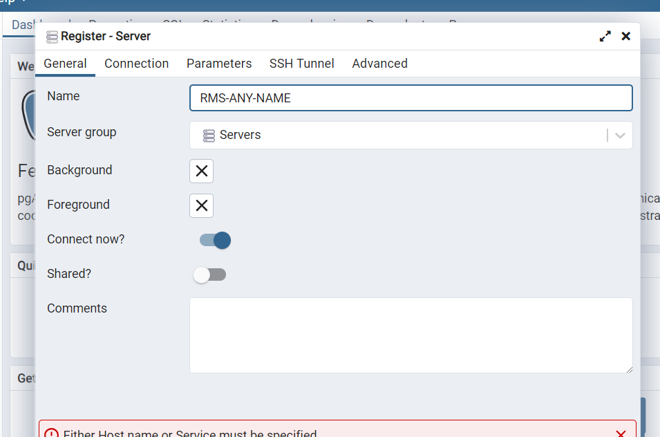

# Database migrations with YoYo

*view in preview for images, otherwise view images in images folder.*

Based on: https://www.youtube.com/watch?v=2ldy3HcW_w8 with a variety of adaptations for my Windows set up.

https://ollycope.com/software/yoyo/latest/#

Set up of Docker with Postgress, PgAdmin and Adminer with Python CRUD.

Combines PgAdmin and Adminer for DB viewing.

Don't forget `docker compose up -d` or `docker compose up`.


## Set up Docker-Postgres-PgAdmin-Adminer
[My YouTube Video](https://youtu.be/mipRKPHwlBkI)

https://youtu.be/mipRKPHwlBk

I use a named volume here but video has bind mount volume - used in `docker-compose-bound-mount.yml`

NOTE
```
conn = psycopg2.connect(
    database="postgres",
    user="postgres",
    password="postgres",
    host="host.docker.internal", !!! localhost etc don't seem to work...
)
```

### PgAdmin




<!--  -->


- http://localhost:5050/
- admin@email.com
- admin

register-server

page-1 use any name
page-2:
      - POSTGRES_DB=postgres # optional
      - POSTGRES_USER=postgres
      - POSTGRES_PASSWORD=postgres

run docker-compose up in terminal ->

 ✔ Network postgres_default       Created                                                                                 
 ✔ Container postgres-pg-admin-1  Created                                                                                 
 ✔ Container postgres-postgres-1  Created                                                                                 
 ✔ Container postgres-adminer-1   Created     

### Adminer

admininer login on port http://localhost:8080


### YoYo

When I installed on Windows it complained of 'no pkg_resources'.

This was fixed with installing setuptools, (in requirements.txt).

## Using existing unapplied migrations I ran `yoyo list` I got:


## After `yoyo apply`:


## After two `yoyo rollback`:


## PgAdmin looks like:

